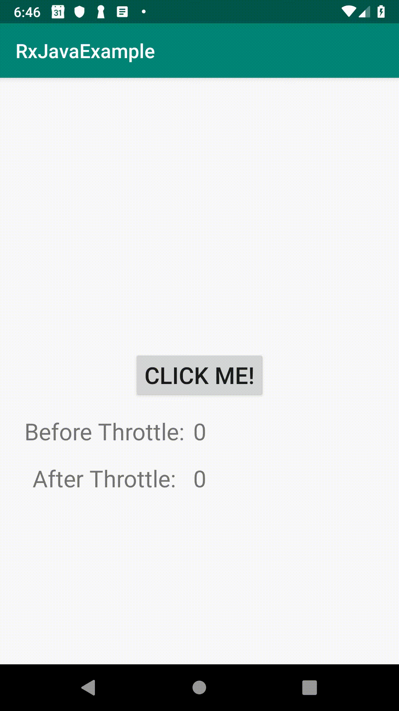

# RxJavaExample

This Android application demonstrates usage of RxJava / RxAndroid
The RxJavaExample is based off 'Reactive Programming with RxAndroid and Kotlin - RxSyntax' https://app.pluralsight.com/library/courses/rxandroid-kotlin-reactive-programming

## Demo

